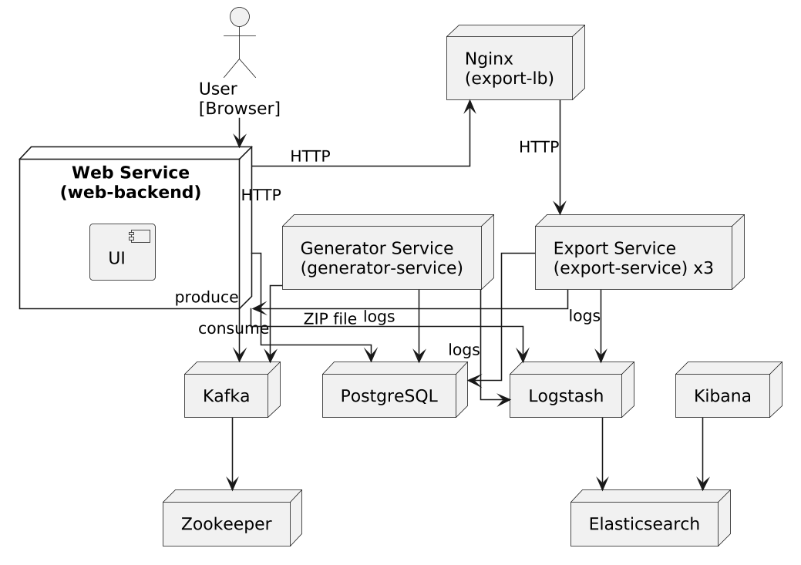

# HSE DSS
Репозиторий с лабораторным работами по дисциплине "Разработка распределенных систем" в НИУ ВШЭ Пермь.  

*Тема работы*: Разработка системы автоматической генерации тестов для задач по спортивному программированию с учётом
настроек пользователя.

# Ограничения
В рамках данного курса была выполнена лишь часть заявленной темы. В частности, рассматривалась работа лишь
с тестами и задачами.

# Лабораторные работы
Всего было 4 лабораторных работ, для каждой из которых был написан отчет (`report.md` файл). Каждая работа была 
выполнена в отдельной ветке. 
1. `practice0` - CRUD API для одной entity + InMemoryStorage.
2. `practice1` - БД + UI + CI (сборка + автотесты + линтер).
3. `practice2` - Разбиение монолита на микросервисы.
4. `practice3` - Масштабирование компонентов (горизонтальное) + централизованное логирование микросервисов.

# Что было сделано в итоге?
В итоге были реализованы 3 микросервиса:
1. `Web-service` - основное веб-приложение (UI + API Gateway). Отвечает за управление задачами и тестами (CRUD) +
   вызывает другие микросервисы (Producer).
2. `Export-service` - микросервис для экспорта данных (генерация zip-архива для скачивания). Общение с сервисом
   синхронное, через `HTML`.
3. `Generator-service`- микросервис для генерации тестов (Consumer). Общение асинхронное, через `Kafka`. 

Для горизонтального масштабирования был добавлен `njinx`, который перехватывал запросы с `web-service` 
на `export-service`. Был настроен `CI` с автоматическим тестированием и анализом кода.
Был добавлен `ELK` для логирования. Написан `docker-compose` для быстрого развертывания. Использовал миграцию БД.
Были написаны юнит и интеграционные тесты.

# Гайд по запуску. 
1. Скачать репозиторий.
2. Зайти в командную строку.
3. Запустить docker:  `docker compose up --build --scale export-service=3`.
4. Пользоваться на: http://localhost:8081/tasks.
5. `Kibana` доступна на: http://localhost:5601/.
6. Закрыть docker: `ctrl + c`.

# Стек
1. `Java 21` & `Gradle`.
2. `Spring & Spring Boot` (`web` + `jpa` + `validation` + `test`).
3. `Lombok` + `Liquibase` + `Thymeleaf` + `Jackson`. 
4. `PostgreSQL` + `ELK` + `NJINX` + `Kafka`.
5. `Dockerfile` & `Docker compose`;