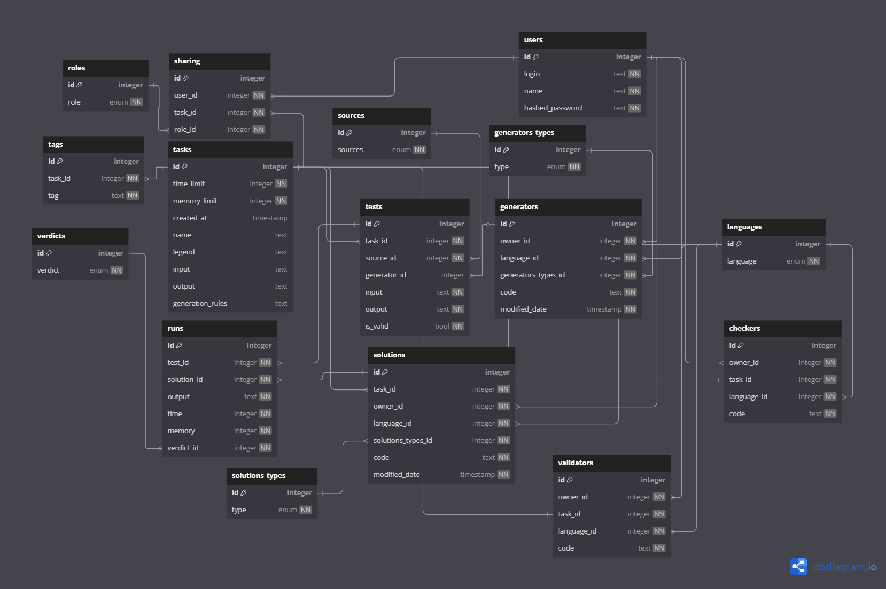
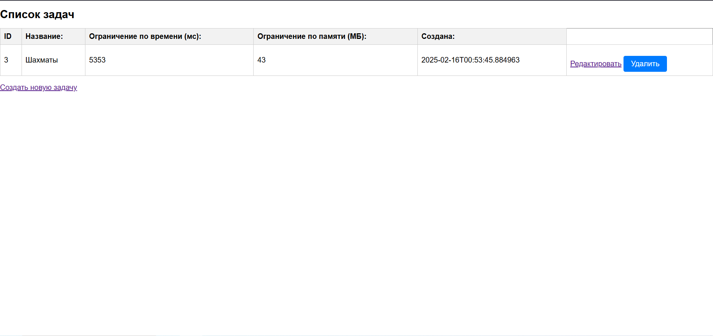
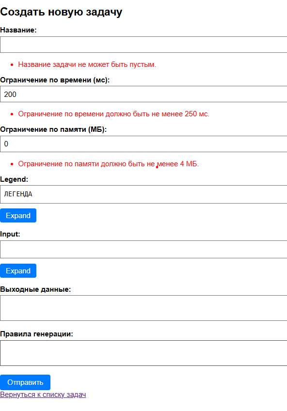
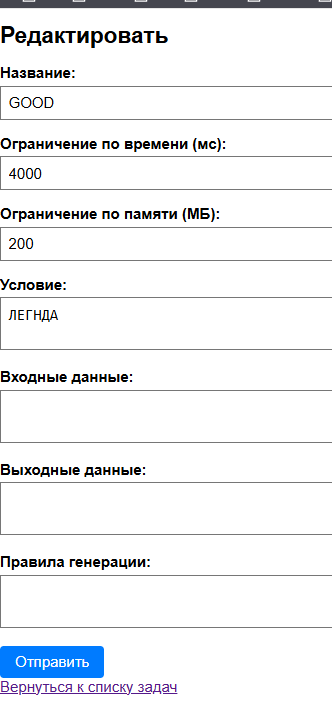
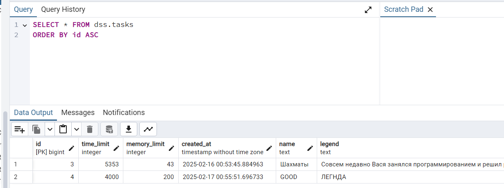

# 0. База данных
У меня получилась такая БД для MVP ВКР'а

Подробнее можно посмотреть по [ссылке](https://dbdiagram.io/d/DIP-67b0b7ec263d6cf9a044f2dc) 
Также можно почитать [описание бд](./draft/datamodel/model.md)
Все идеи для записываю в [отдельный файл](./draft/ideas.md)

# 1. Какая часть системы сделана в этой работе?
В рамках этой работы я сделал CRUD форму для задач

# 2. CQRS 
Я не использую CQRS в текущей версии системы:
1. **Нет сложных требований к чтению/записи**
   1. На данном этапе система имеет простой CRUD.
   2. Количество операций чтения (Queries) и записи (Commands) примерно одинаково и нет существенного различия в нагрузке,
   которое заставляло бы разделять их архитектурно.
2. **Дополнительная сложность**
   1. CQRS вносит существенную дополнительную сложность в архитектуру: нужны отдельные модели данных для команд и запросов,
   синхронизация через события, возможное eventual consistency и т.д.
   2. При простом CRUD это усложняет код без существенной пользы.
3. **Достаточно MVC + асинхронность**
   1. Сейчас я использую классический MVC, где все операции (в том числе обращения к БД) асинхронны (`Async + CompletableFuture`)
   2. Этого достаточно для масштабирования и удобной разработки на текущем этапе.

# 3. Тесты
Написал юнит + интеграционные тесты

# 4. Docker
Написал Docker и Docker-compose файлы
Гайд по запуску:
1. Скачать репозиторий.
2. Зайти в командную строку.
3. Перейти в папку `docker`: `cd docker`
4. Запустить docker: ` docker-compose up --build`
5. Пользоваться на: `http://localhost:8080/tasks`
6. Закрыть docker: `ctrl + c`

# 5. Пример работы:
 
 

 

