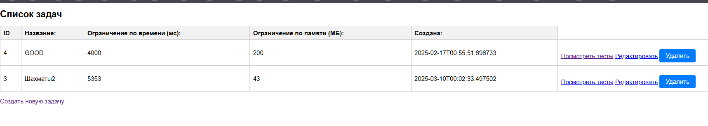

# 1. Микросервисы.
В рамках данной работы я выделил 3 микросервиса:
1. `Web-service` - основное веб-приложение (UI + API Gateway). Отвечает за управление задачами и тестами (CRUD) +
вызывает другие микросервисы (Producer).
2. `Export-service` - микросервис для экспорта данных (генерация zip-архива для скачивания). Общение с сервисом
синхронное, через `RestTemplate`. Был выбран такой способ, потому что пользователь ожидает немедленный результат и сама 
по себе операция создания архива относительно быстрая. Делать через `Kafka` избыточно. 
3. `Generator-service`- микросервис для генерации тестов (Consumer). Общение асинхронное, через `Kafka`. 
Генерация тестов может занимать длительное время. Система не должна блокировать пользователя,
ожидая окончания генерации. Может быть высокая нагрузка. 

P.S. В рамках текущей работы в `Generator-service` создаются каждый раз случайные тесты. Это заглушка.  
P.S.S. Чтобы увидеть новые тесты, нужно обновить страницу. На данный момент тесты динамически не
добавляются.

# 2. Тесты
Дописал unit и интеграционные тесты для микросервисов.

# 3. Docker
Обернул сервисы в Dockerfile и обновил docker-compose. План работы:
1. Скачать репозиторий.
2. Зайти в командную строку.
3. Запустить docker:  docker-compose up --build
4. Пользоваться на: http://localhost:8081/tasks
5. Закрыть docker: ctrl + c

# 4. Пример работы.
Пример CRUD для задач есть в отчете [practice1-report](practice1-report.md). В рамках примера в этом отчете будет
работа с тестами.

 

