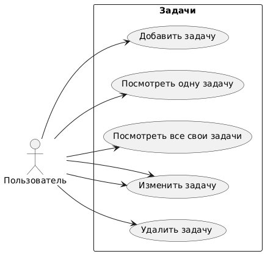
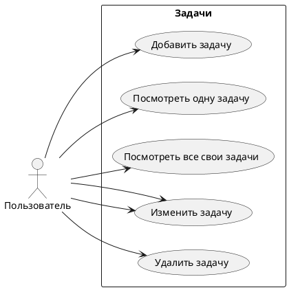
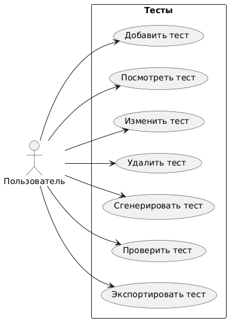
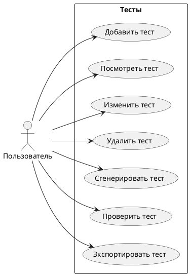

# 1. Выбрать тему для Вашей новой DSS (примеры тем) или придумать и согласовать свою.
Разработка системы автоматической
генерации тестов для задач по
спортивному программированию с учётом
настроек пользователя.

# 2. Создать репозиторий для работы над Вашей DSS.
Я создал репозиторий.

# 3. Выявить первоначальные требования к Вашей DSS.
1. Пользователь может создать задачу.
2. Пользователь может посмотреть одну задачу.
3. Пользователь может посмотреть все свои задачи.
4. Пользователь может изменить задачу.
5. Пользователь может удалить задачу.
6. Пользователь может сгенерировать тесты к задаче.

# 4. Создать модель предметной области Вашей DSS.
## Use case
### Задачи

### Тесты

## DDD
**Основные доменные сущности**:
1. **Task (Задача)** – описание задачи, входные и выходные данные.
2. **TestCase (Тестовый пример)** – отдельный тест с входными и ожидаемыми выходными данными.
3. **TestGenerator (Генератор тестов)** – сервис, создающий тесты на основе алгоритмов.
4. **TestAnalyzer (Анализатор тестов)** – оценивает тесты по разным параметрам.
5. **User (Пользователь)** – автор задач, который работает с системой.

**Границы контекста**:
1. **Task Management (Управление задачами)** – CRUD для задач.
2. **Test Generation (Генерация тестов)** – автоматическое создание тестов.
3. **Test Analysis (Анализ тестов)** – проверка покрытия, сложности, качества тестов.
4. **Export System (Экспорт тестов)** – выгрузка тестов в нужном формате.

**Ubiquitous Language (Глоссарий)**:
1. **Задача (Task)** – описание условия, входных и выходных данных.
2. **Тест (TestCase)** – отдельный пример входных данных и ожидаемого результата.
3. **Генератор тестов (TestGenerator)** – система, автоматически создающая тесты.
4. **Анализатор тестов (TestAnalyzer)** – система, оценивающая качество тестов.
5. **Экспорт тестов (Test Export)** – процесс сохранения тестов в нужном формате.
6. **User (Пользователь)** – автор задач, который работает с системой.

# 5. Выбрать инструментарий (язык, IDE/редактор кода, etc.) 
* Java 21, Spring, PostgreSQL.
* IntelliJ IDEA Community Edition 2024.2.1.

# 6. Выбрать модель данных для реализации Вашей DSS:
* На уровне приложения - классы, отображающие сущности в бд
* На уровне - реляционная бд PostgreSQL

# 7. Реализовать первоначальные требования (из п.3) к Вашей DSS. 
Реализовал.

# 8. Загрузить первую версию DSS на веб-хостинг (Github, Gitlab, etc.)
Загрузил.